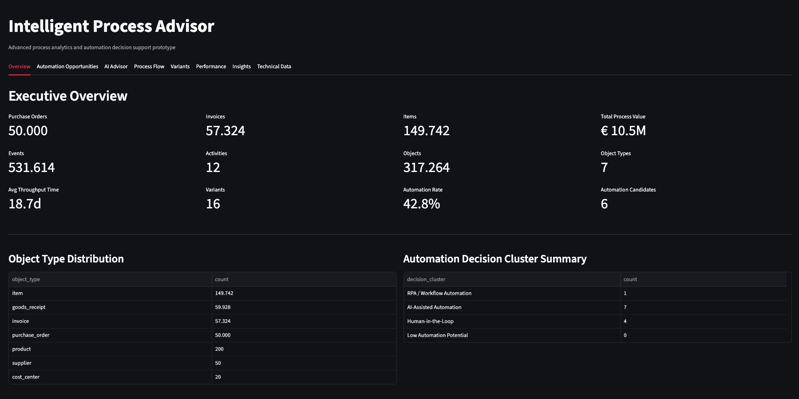
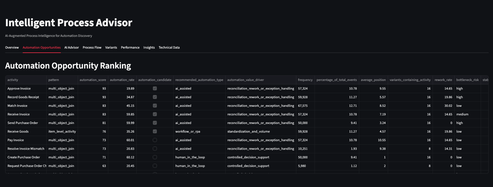
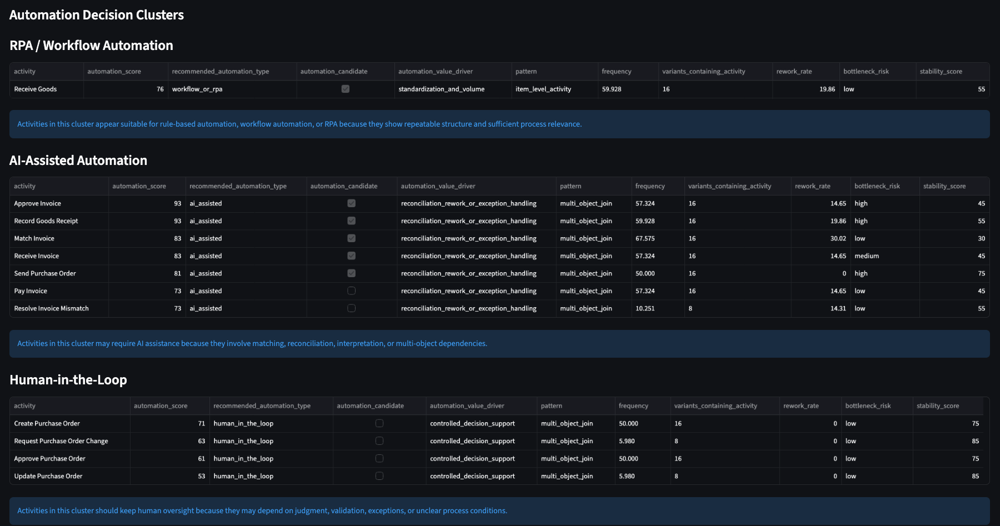
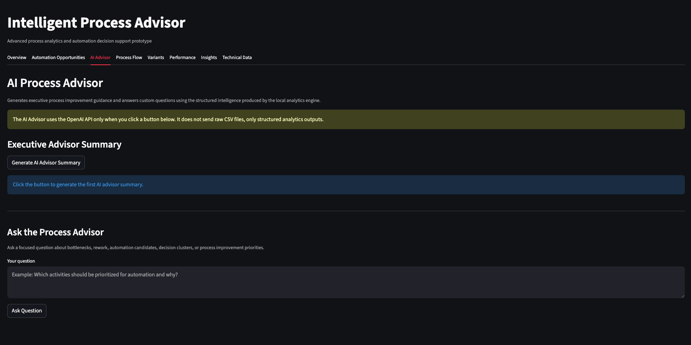

# Intelligent Process Advisor

AI-Augmented Process Intelligence for Automation Discovery

An AI-augmented Process Intelligence system that analyzes Object-Centric Event Logs (OCEL), generates process analytics and explainable operational insights, provides a conversational AI assistant, and supports intelligent automation decisions across RPA, AI-assisted automation, human-in-the-loop workflows, and process redesign initiatives.

---

## Overview

Intelligent Process Advisor is an experimental Process Intelligence system designed to bridge process analytics and operational decision-making.

The system combines:

- object-centric process analytics
- process flow intelligence
- explainable operational insights
- automation-oriented reasoning
- natural language process exploration

The goal is not only to understand processes, but to support structured operational and automation decisions directly from process data.

---

## Current Prototype

The current prototype can:

- ingest OCEL-style process data from CSV
- analyze activity-object relationships
- identify process variants
- detect interaction and dependency patterns
- generate process flow analytics
- generate explainable process insights
- visualize analytical outputs through a Streamlit dashboard

Current analytics include:

- activity frequency
- process variants
- directly-follows relationships
- start and end activities
- object dependencies
- multi-object interaction patterns
- item-level processing signals

---

## Example Workflow

```text
OCEL / CSV process data
→ process analytics
→ process insights
→ dashboard visualization
→ natural language process exploration
→ automation decision support
```

---

## Example Natural Language Questions

The system is designed to support questions such as:

- Which activities appear to be the strongest automation candidates?
- Which process areas show the highest operational complexity?
- Where do object dependencies create reconciliation risks?
- Which variants create the most inefficiency?
- Which activities are highly repetitive and rule-based?
- Which activities may require human judgment instead of automation?

---

## Architecture

### Ingestion Layer

Loads and validates Object-Centric Event Logs (OCEL).

### Process Analytics Layer

Generates structural and operational process signals from object-centric process data.

### Insight Layer

Transforms analytical signals into explainable operational insights.

### AI Intelligence Layer

Provides AI-assisted process interpretation, automated analytical summaries, deep process exploration, and conversational interaction through natural language process reasoning.

### Decision Support Layer

Supports automation-oriented reasoning across:

- RPA
- AI-assisted automation
- human-in-the-loop workflows
- process redesign

### Interface Layer

Provides dashboard-based process exploration and visualization.

---

## Dashboard Preview

### Executive Intelligence Overview

High-level operational KPIs, object-centric process metrics, automation indicators, throughput analytics, and executive process intelligence summaries generated from the analytical engine.



---

### Automation Opportunity Ranking

Rule-based and AI-assisted automation opportunity scoring across process activities using operational indicators such as:

- automation score
- current automation rate
- rework rate
- bottleneck risk
- process stability
- activity frequency
- automation candidate classification



---

### AI-Assisted Automation Decision Clusters

Automation recommendations grouped into explainable operational clusters across:

- Workflow / RPA automation
- AI-assisted automation
- Human-in-the-loop decision support



---

### AI Process Advisor

Conversational AI-assisted process exploration and executive operational guidance powered by structured process intelligence outputs.



---

## Demo

Short demo video available on LinkedIn:

[LinkedIn Demo Placeholder]

---

## Current Dataset

The current prototype uses a synthetic Purchase-to-Pay (P2P) Object-Centric Event Log containing:

- purchase orders
- invoices
- goods receipts
- line items

The dataset simulates:

- multi-object dependencies
- reconciliation activities
- item-level processing
- process variation
- operational complexity

---

## Repository Structure

```text
intelligent-process-advisor/

app/
  dashboard.py

data/
  p2p_sample/

outputs/
  activity_insights.json

src/
  ingestion/
  features/
  export/
  main.py

requirements.txt
README.md
```

---

## Technology Stack

- Python
- Pandas
- PM4Py
- Streamlit

---

## Future Directions

Potential future extensions include:

- direct OCEL / CSV upload workflows
- advanced process visualizations and BPMN-style process flows with decision points
- interactive filtering and drill-down exploration
- expanded operational context / master data integration for richer process correlation and analysis
- deep root cause discovery engine with ML-assisted features

---

## Status

Current focus:
- improving insight quality and contextual reasoning
- expanding interactive analytics capabilities with filters and selections
- enhancing process exploration and automation intelligence

---

## Author

Emre Yazıcıoğlu

Building Process Intelligence systems that connect process analytics to operational and automation decisions.